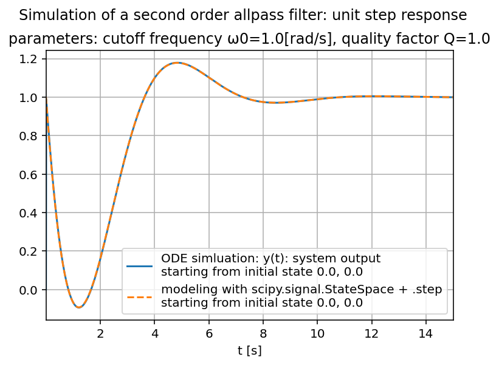
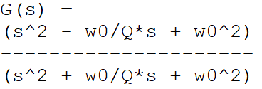
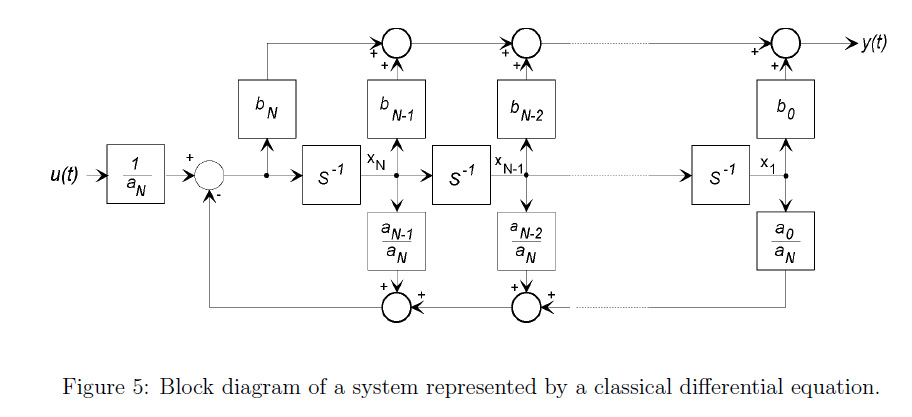

2025-02-11:

\
Added *6.4c_SECOND-ORDER ALLPASS_step_response.py* file https://github.com/PLC-Programmer/Python/blob/master/systems%2Cfilters_and_feedback-controls/all-pass_filters/6.4c_SECOND-ORDER%20ALLPASS_step_response.py which shows how to successfully transform a transfer function G(s) with derivatives in its numerator polynomial into a state-space representation, for example for a second order all-pass filter:

This state-space representation, composed of only first order ODE's (ordinary differential equations), is then simulated, that is integrated, with the Runge–Kutta method.

To check the result of the Runge–Kutta method, two functions from the SciPy signal processing toolbox (https://docs.scipy.org/doc/scipy/reference/signal.html) have been used: both calculations get the almost identical result for the unit step response! (except for the very first data point which the plot doesn't show for this reason)

When you have a transfer function G(s) with derivatives in its numerator polynomial, getting a correct state-space representation might not be so easy (at first). The problem is that in this case you have derivatives of the input signal u(t)!

For example:

G(s) = Y(s)/U(s) = (bn·sn + ... + b0) / (an·sn + ... + a0)

U(s) = system input (system == filter here)

Y(s) = system output

bn·sn + ... + b0 == numerator polynomial

an·sn + ... + a0 == denominator polynomial

=>

(an·sn + ... + a0)·Y(s) = (bn·sn + ... + b0)·U(s) (A)

Solution to this problem:

As explained in the source code file, the solution is to introduce a dummy variable Z(s), or z(t) in time domain.

To better accomplish this, we re-write equation (A) a little bit:

Y(s) = ((bn·sn + ... + b0) · 1/(an·sn + ... + a0))·U(s)

Now we introduce dummy variable Z(s)..

Z(s) := 1/(an·sn + ... + a0)·U(s)

..which will yield this equation for the output signal:

Y(s) = (bn·sn + ... + b0)·Z(s)

Only now we can conveniently start to work in the time domain. For this example it means:

z'' + w0/Q·z' + w0^2·z = u <-- no more derivatives of input signal u (=u(t)) !!

(z' := dz/dt etc.)

Now we can introduce the usual state variables x1(t) and x2(t) (for the second order system):

x1 := z

x2 := z'

=>

x1' = x2

=>

x2' + w0/Q·x2 + w0^2·x1 = u

Output signal y(t) becomes:

y = z'' - w0/Q·z' + w0^2·z

=>

y = x2' - w0/Q·x2 + w0^2·x1

= -w0/Q·x2 - w0^2·x1 + u - w0/Q·x2 + w0^2·x1

= -2·w0/Q·x2 + u

If somebody is really familiar with the topic of state-space representation, this person might find the phase variable form or companion form of a state-space representation directly from the transfer function (I'm not. I have to go through all the ODE's first.):

from: http://web.mit.edu/2.14/www/Handouts/StateSpace.pdf

(2.14 Analysis and Design of Feedback Control Systems, State-Space Representation of LTI Systems, Derek Rowell, October 2002)
